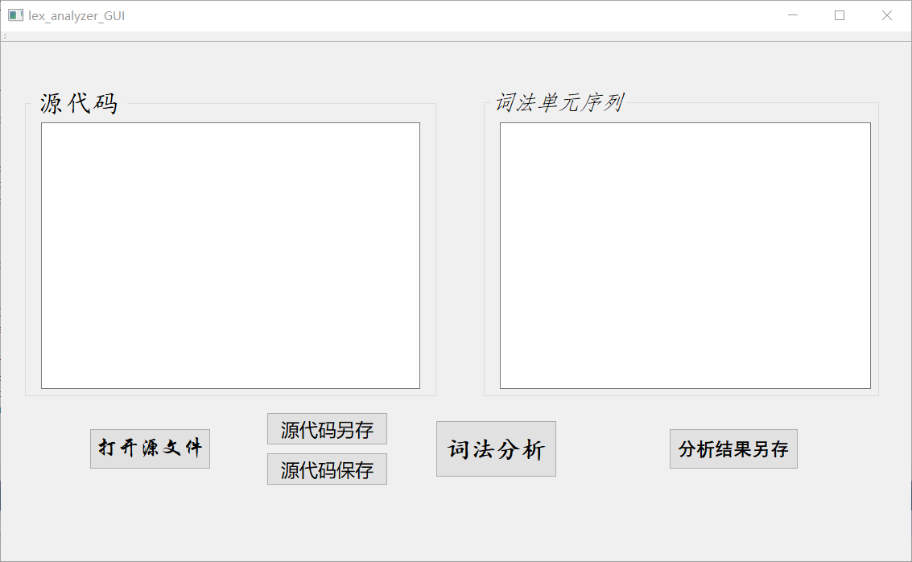
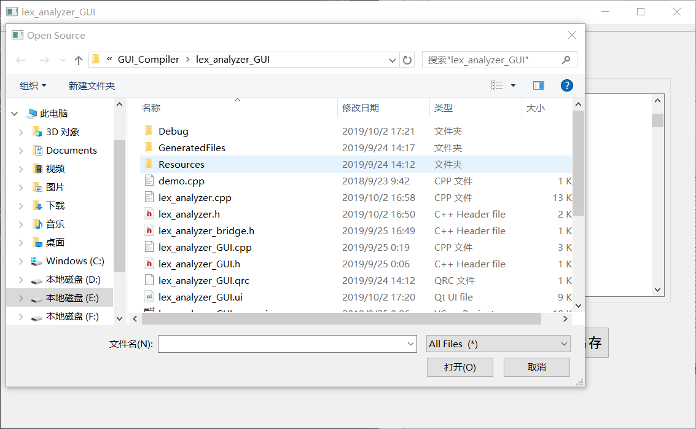
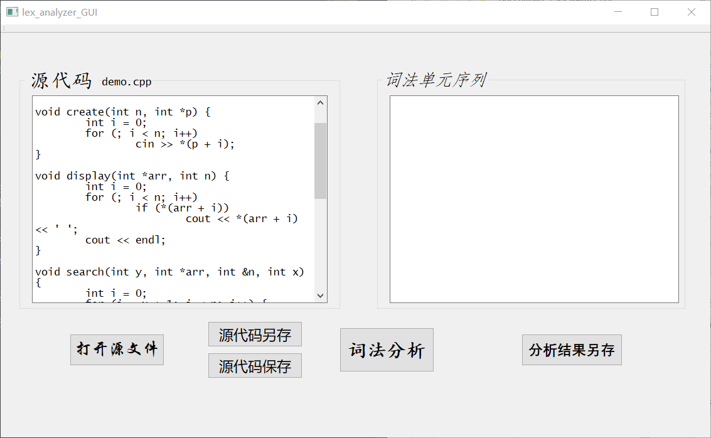
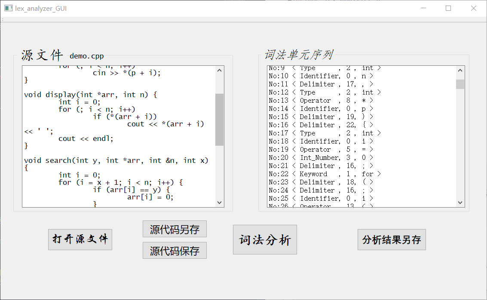
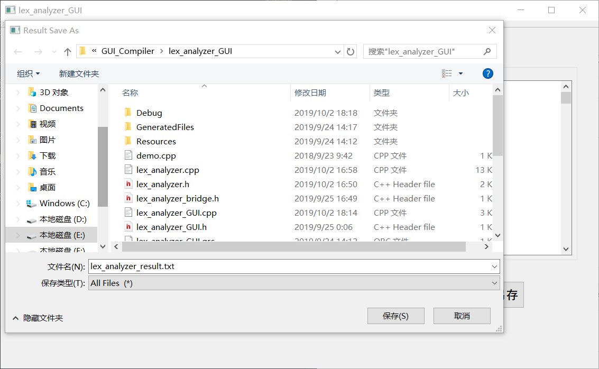
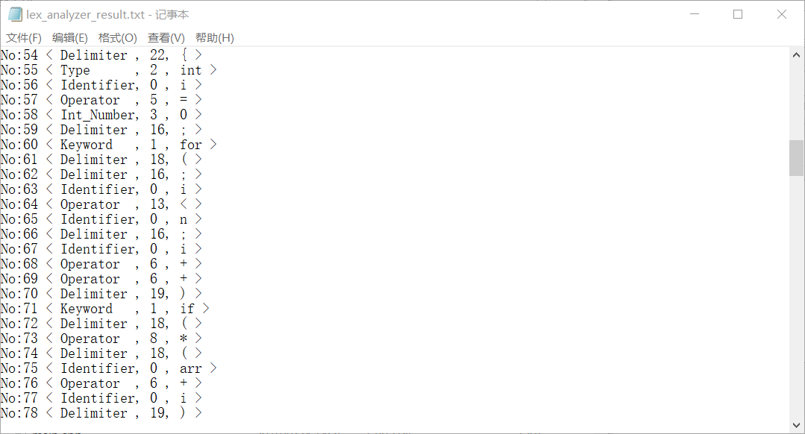
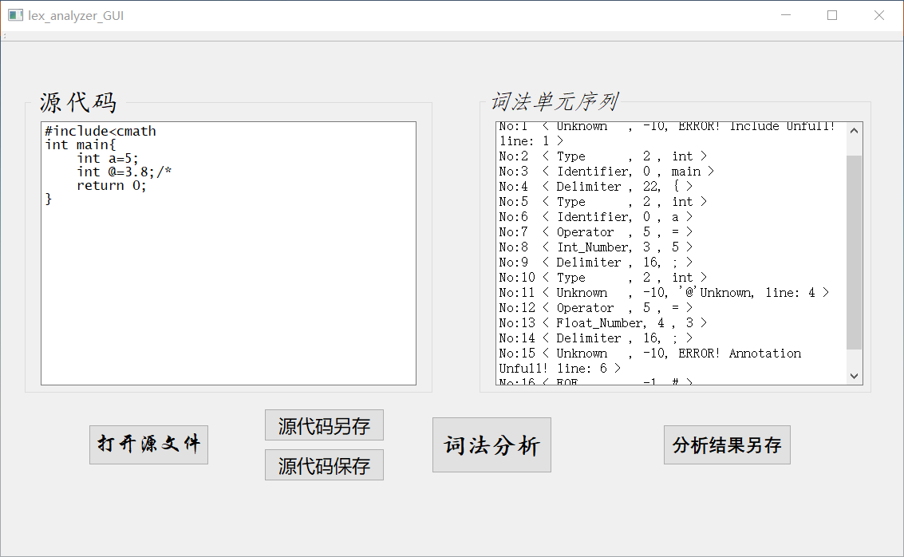

# Lexical-Analyzer

**同济大学计算机专业《编译原理》课程实验——词法分析器**

## 一、实验任务

### 1.1 实验目的

- 1.掌握词法分析器的生成原理，如何将源文件分析并转化为单词符号表。
- 2.掌握使用高级程序语言实现简单语言的词法分析器的方法。
- 3.掌握将生成结果写入文件的技术

### 1.2 实验要求 

- 1. 使用高级程序语言作为实现语言，实现一个简单类C语言的词法分析器。编码实现词法分析器的组成部分。
- 2. 给出某高级程序设计语言的单词子集及机内表示, 如P42表3.1所示，试编写一个词法分析器，输入为源程序字符串，输出为单词的机内表示序列。
- 3. 在完成以上基本要求情况下，对程序功能扩充：
 - 3.1 增加单词（如保留字、运算符、分隔符等）的数量；
 - 3.2 将整常数扩充为实常数；
 - 3.3 增加出错处理功能；
 - 3.4 增加预处理程序，每次调用时都将下一个完整语句读入扫描缓冲区，去掉注解行，并能对源程序列表打印； 
 
 ## 二、实现功能
 
- 1. **基本功能：**
 - 1.1 采用C++语言作为编程语言实现类C语言的词法分析器，输入为源程序文件，输出为词法单元序列。
-  1.2 识别开始时先将注释除掉
- 2. **扩展功能：**
 - 2.1 增加了关键字$include$, $define$, $float$, $char$；
 - 2.2 增加了分隔符$'.'$, 单引号, 双引号；
 - 2.3 常数类型由整形扩展到实型、布尔型以及字符型
 - 2.4 增加了出错处理功能；
 
 ## 三、操作说明
 
 &emsp;&emsp;程序能够根据输入的源程序分析源文件的词法结构，将字符串中的内容单独独立出来，并按照$<Type,\ Index,\ Value>$的三元组格式输出词法单元序列——$Type$表示单词类型，$Index$记录对应的**表1**中的序号，$Value$记录单词的属性值。

&emsp;&emsp;程序初始时为空白文本框界面，通过“**打开源文件**”按钮选择需要进行词法分析的源程序并打开，此时左侧文本框中显示源程序的代码，并且给出源代码文件名的提示。

&emsp;&emsp;左侧的源代码文本框可以根据需要进行编辑修改，**不会**改动源文件的内容；“**源代码保存**”将源代码文本框中的内容保存到原路径，“**源代码另存**”打开文件对话框，将源代码文本框中的内容保存到指定路径。点击窗体中间的“**词法分析**”按键，将**源代码文本框**中的程序代码分析成词法单元序列，并且显示在右侧文本框中。

&emsp;&emsp;右侧的词法单元序列文本框为分析结果，不可手动修改，且此结果只是临时保存。通过“**分析结果另存**”按钮，可以根据需要手动将结果保存到文件中，结果文件默认路径为$"./lex\_analyzer\_result.txt"$。

&emsp;&emsp;程序能够识别的词法错误类型包括：*注释未闭合*、*头文件格式错误*、*未定义符号*，并且能够将错误定位到源代码文件的行数（行数指确认为错误的行数）。

